# Reclaim — System Design Document

Razorpay AI Builder Internship 2026 · Track 3 · Solo · Gemini-powered standalone agentic revenue-recovery platform

This document defines the HLD, LLD, agent runtime, AI boundary, APIs, data model, event model, frontend architecture, and deployment design.

## 1. Design Principles

1. Reclaim owns the agent runtime.
2. Gemini is an LLM provider, not the product architecture.
3. AI performs diagnosis, candidate generation, counterfactual reasoning, planning, and replanning.
4. Deterministic infrastructure controls payment state, safety, scoring, execution, and idempotency.
5. Every important agent transition is observable and persisted.
6. Frontend visualizations represent actual backend events, not simulated animations.
7. The system remains small enough for a solo 14-day build.

## 2. High-Level Architecture

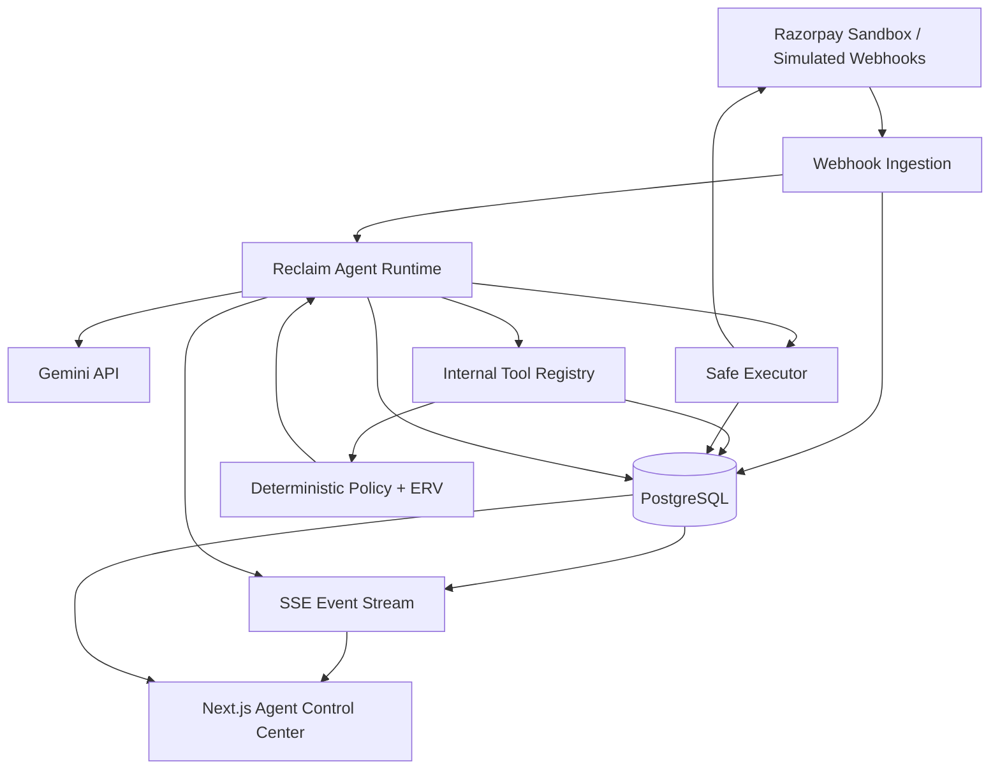

## 3. Agent Runtime Architecture

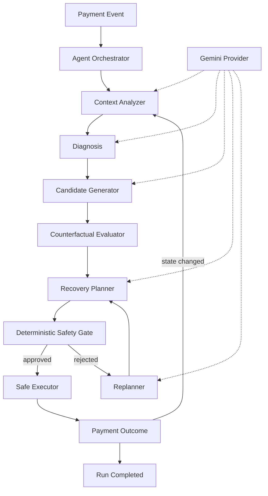

The boxes above are **logical agent stages**, not necessarily separate LLM calls. One Gemini interaction can perform several stages when that is cheaper and simpler; the runtime remains responsible for state and tool execution.

## 4. Why This Is a Complete Agent

The agent is not defined as "call Gemini and display its answer." It owns a control loop:

```text
observe
  -> diagnose
  -> propose
  -> evaluate
  -> plan
  -> validate
  -> act
  -> observe outcome
  -> replan if necessary
```

The LLM is responsible for judgment within this loop. Reclaim is responsible for the loop itself.

## 5. AI / Deterministic Boundary

```text
                    AI CONTROLLED
        +----------------------------------+
        | failure diagnosis                |
        | contextual interpretation        |
        | candidate generation             |
        | counterfactual reasoning         |
        | plan generation                  |
        | replanning                       |
        +----------------+-----------------+
                         |
                         v
                STRUCTURED PLAN
                         |
        +----------------+-----------------+
        | DETERMINISTIC CONTROL            |
        | hard constraints                 |
        | ERV calculation                  |
        | action validation                |
        | idempotency                      |
        | payment state                    |
        | execution                        |
        | audit                            |
        +----------------------------------+
```

This prevents an LLM-generated statement such as `retry_now` from becoming a financial action without validation.

## 6. Gemini Provider

Use Google's `google-genai` Python SDK. The current Gemini API supports API-key authentication through `GEMINI_API_KEY`; keep credentials on the backend. citeturn0search0turn0search2

```text
GEMINI_API_KEY=<secret>
GEMINI_MODEL=<configured model>
```

Provider interface:

```python
class LLMProvider:
    async def structured_generate(
        self,
        *,
        system: str,
        input: dict,
        schema: dict,
    ) -> dict:
        ...
```

Implementation:

```text
agent_runtime/provider.py
        |
        v
agents/gemini_provider.py
        |
        v
Google GenAI SDK
        |
        v
Gemini API
```

No frontend component imports the Gemini SDK.

## 7. Data Model

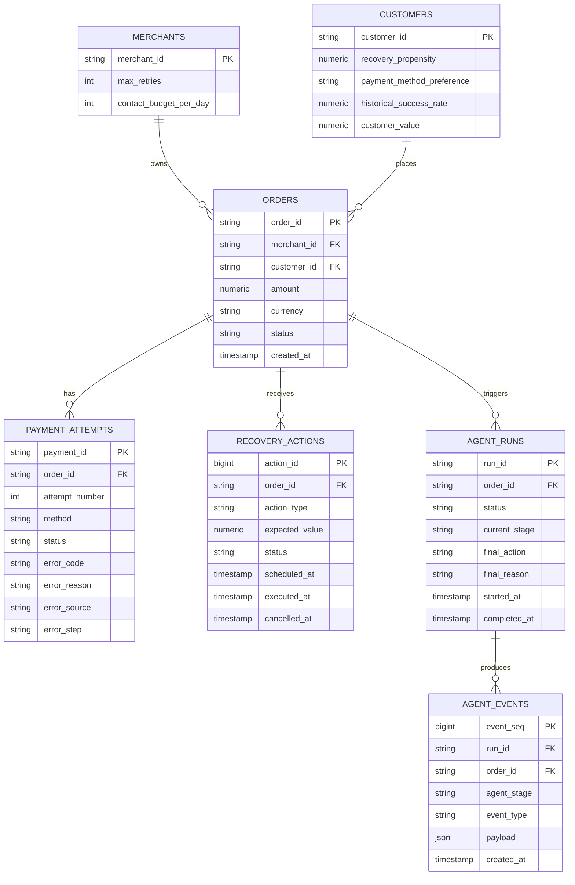

## 8. State Machines

### Order

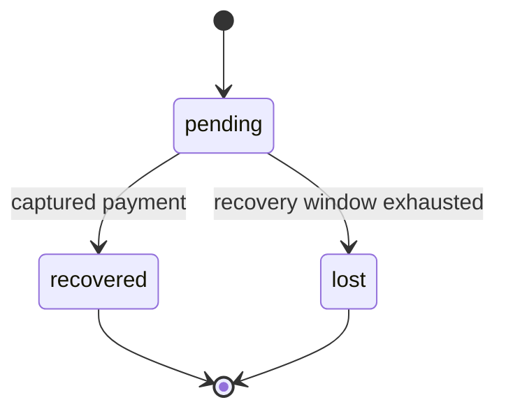

### Agent Run

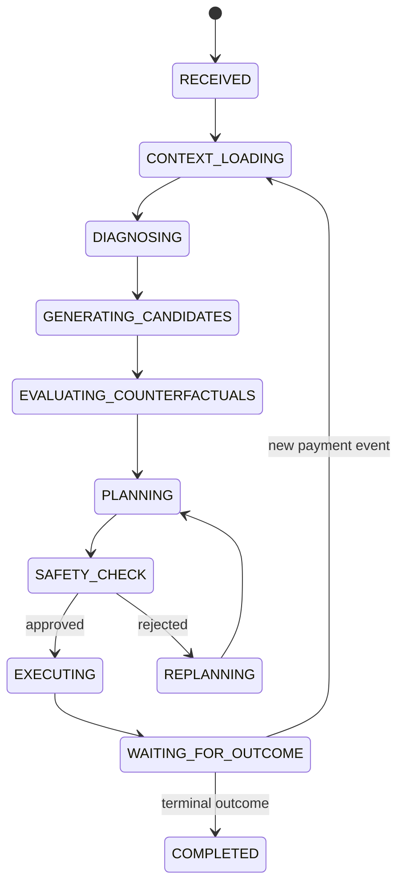

### Recovery action

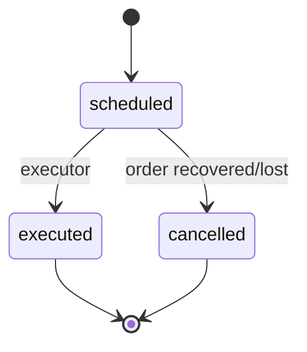

## 9. Core Agent Sequence

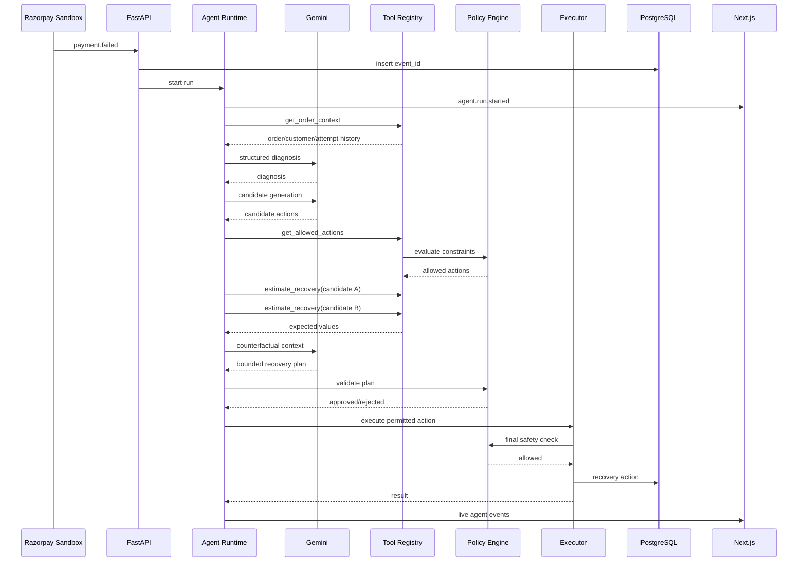

## 10. Replanning Sequence

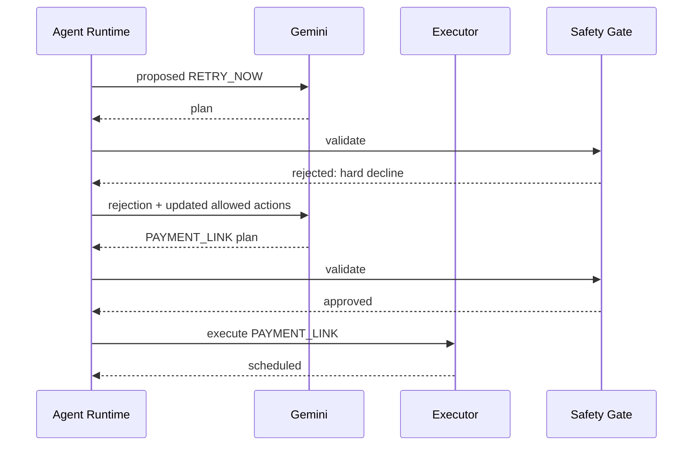

This is a key live demonstration of adaptive agent behavior.

## 11. Idempotency Sequence

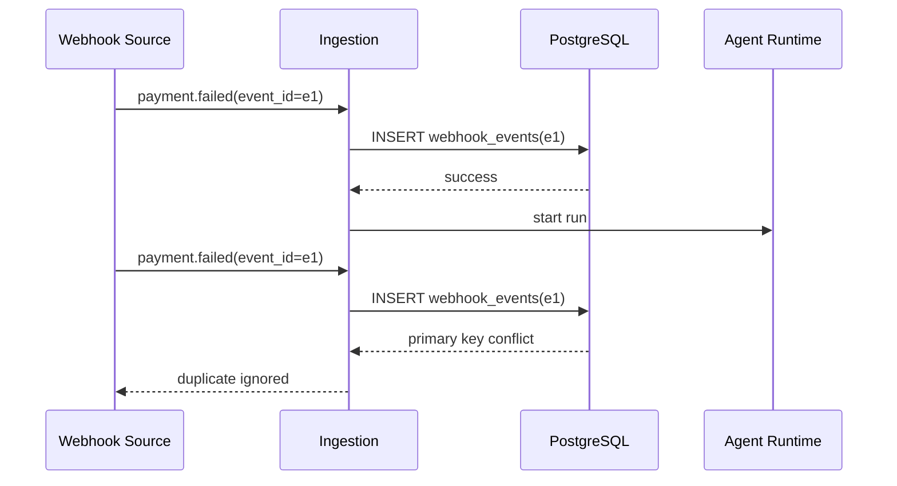

## 12. Tool Registry

Internal tools:

```text
get_order_context(order_id)
get_customer_history(customer_id)
get_allowed_actions(order_id)
estimate_recovery(order_id, action)
get_action_cost(action)
create_recovery_action(order_id, action, schedule)
execute_recovery_action(order_id, action)
cancel_pending_action(order_id)
```

The registry adds metadata:

```json
{
  "name": "get_allowed_actions",
  "description": "Return actions permitted by deterministic payment and merchant constraints.",
  "read_only": true,
  "financial_side_effect": false
}
```

Execution tools must be marked as side-effecting and require final policy validation.

## 13. API Contract

| Method | Path | Purpose |
|---|---|---|
| GET | `/health` | health check |
| GET | `/orders` | order list |
| GET | `/orders/{order_id}` | full order + agent context |
| POST | `/webhooks/simulate` | simulated webhook |
| GET | `/eval/summary` | baseline comparison |
| GET | `/agent-runs` | recent agent runs |
| GET | `/agent-runs/{run_id}` | run detail |
| GET | `/agent-runs/{run_id}/events` | SSE stream |
| POST | `/agent-runs/{run_id}/replay` | replay a run for demo/testing |

## 14. Frontend Architecture

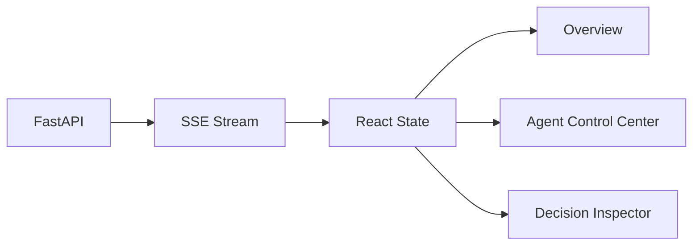

### Agent Control Center components

```text
AgentRunHeader
AgentGraph
AgentStageNode
AgentEventTimeline
ToolCallPanel
CandidateComparison
RecoveryPlanPanel
SafetyGatePanel
ExecutionPanel
```

### Stage node states

```text
IDLE
RUNNING
COMPLETED
REJECTED
FAILED
WAITING
```

Each node receives its state from persisted `agent_events`.

## 15. Agent Event Contract

```json
{
  "event_seq": 183,
  "run_id": "run_001",
  "order_id": "order_001",
  "agent_stage": "EVALUATING_COUNTERFACTUALS",
  "event_type": "candidate.evaluated",
  "payload": {
    "action": "RETRY_DELAYED",
    "probability": 0.61,
    "expected_value": 1436,
    "latency_ms": 842
  },
  "created_at": "2026-08-25T10:00:00Z"
}
```

The frontend should be able to reconstruct the complete run from the event stream.

## 16. Security

- Gemini API key exists only on the backend.
- `.env` is gitignored.
- Tool inputs are Pydantic-validated.
- LLM output is schema-validated before entering the runtime.
- LLM output never directly writes payment state.
- Side-effecting tools always re-check policy.
- Every side-effect is logged.
- Webhook events are deduplicated by `event_id`.
- The demo uses test/synthetic payment data.

## 17. Observability

Track:

```text
agent_run_id
order_id
stage
model
model_latency
input_tokens/output_tokens when available
number_of_tool_calls
candidate_count
replan_count
policy_rejections
execution_status
final_action
recovered_amount
```

This also makes the frontend useful as an agent debugging console.

## 18. Deployment

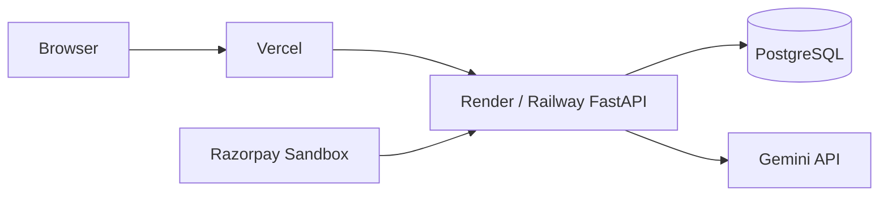

One backend service is sufficient for the hackathon. Do not introduce queues, microservices, or separate agent services unless a real bottleneck appears.

## 19. Scale Story

At production scale:

```text
Webhook ingestion
      |
      v
Queue
      |
      +----> Agent workers
      |
      +----> State processor
      |
      v
Execution queue
      |
      v
Payment provider
```

Other changes:

- read replicas for analytics
- asynchronous agent execution
- model gateway/provider abstraction
- real merchant outcome data replacing the simulator
- rate limiting and per-merchant budgets
- durable workflow state

These are panel discussion points, not hackathon build requirements.

## 20. Final Architecture Statement

> Reclaim is a standalone agentic revenue-recovery platform. Its runtime observes payment events, builds context, diagnoses failures, generates and evaluates recovery alternatives, plans bounded interventions, executes only policy-approved actions, and replans when reality changes. Gemini supplies the reasoning capability; Reclaim owns orchestration, state, tools, safety, execution, observability, and the user-facing agent experience.

## 21. MCP Server Architecture

MCP is a supported interoperability interface over Reclaim's existing domain services.

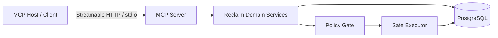

### Core rule

The MCP server contains no independent payment, policy, scoring, or execution implementation.

```text
MCP Tool
   ↓
Application Service
   ↓
Policy / Validation
   ↓
Executor
   ↓
Database / Razorpay Sandbox
```

This prevents a second code path from weakening safety.

### MCP tool catalog

| Tool | Type | Side effect | Description |
|---|---|---:|---|
| `reclaim_get_order_context` | Tool | No | Read order, customer, merchant and attempts |
| `reclaim_get_allowed_actions` | Tool | No | Return actions permitted by policy |
| `reclaim_estimate_recovery` | Tool | No | Calculate recovery probability and ERV |
| `reclaim_get_agent_run` | Tool | No | Retrieve an agent run |
| `reclaim_get_agent_events` | Tool | No | Retrieve run event history |
| `reclaim_get_evaluation_summary` | Tool | No | Return baseline/evaluation metrics |
| `reclaim_start_recovery_run` | Tool | Yes | Start a bounded Reclaim recovery run |
| `reclaim_execute_recovery_action` | Tool | Yes | Execute a policy-approved recovery action |
| `reclaim_cancel_pending_action` | Tool | Yes | Cancel a scheduled recovery action |

### Transport

Use MCP v2 with Streamable HTTP as the primary deployment transport and stdio for local MCP-host integration.

Local endpoint:

```text
http://127.0.0.1:8000/mcp
```

Production:

```text
https://<reclaim-host>/mcp
```

For a deployed hostname, configure the MCP SDK transport host/origin allowlist rather than relying on localhost defaults.

## 22. MCP Server Implementation

Recommended module:

```text
backend/mcp_server/server.py
```

The implementation should register MCP tools that delegate to existing Reclaim application services. The MCP server must not reimplement policy or payment logic.

MCP v2 uses `MCPServer` as the main server class. The Streamable HTTP server can be mounted into an ASGI/FastAPI application using `streamable_http_app()`.

## 23. MCP + FastAPI Integration

Expose REST, SSE, and MCP from the same backend service:

```text
FastAPI
├── /health
├── /orders
├── /webhooks/simulate
├── /eval/summary
├── /agent-runs
├── /agent-runs/{run_id}/events
└── /mcp
      └── MCP Streamable HTTP
```

The MCP server and web application call the same domain services.

## 24. MCP Security

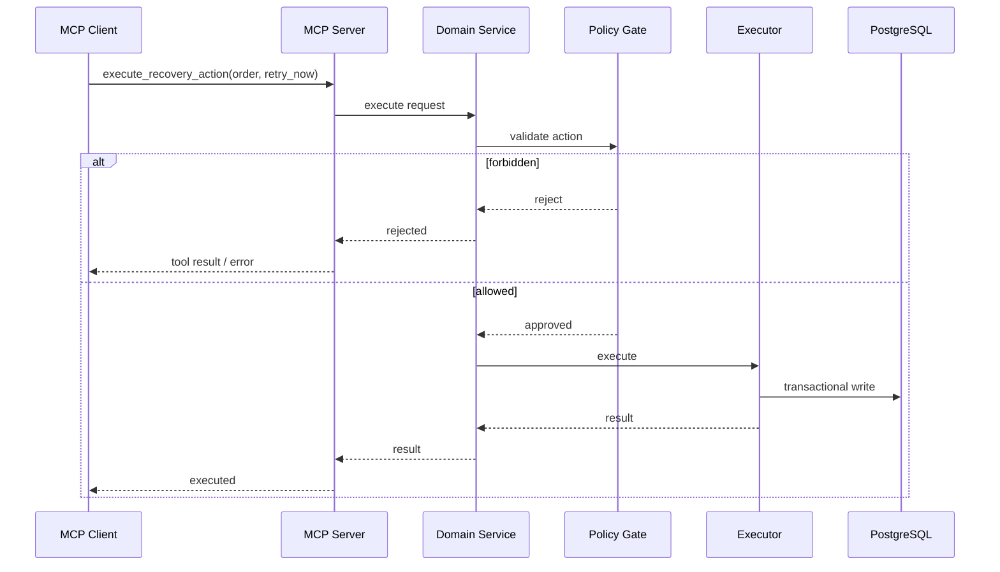

Controls:

- schema validation
- deployment authentication/authorization
- side-effect classification
- order-level idempotency
- audit events
- merchant action limits
- hard decline restrictions
- no direct database writes from MCP handlers

## 25. MCP Page

Dashboard route:

```text
/mcp
```

It displays server status, endpoint, transport, protocol, tool catalog, read/write classification, live activity, latency, policy rejections, safety status, and connection instructions.

The page is an operational console and reads actual backend state.

## 26. Documentation Page

Dashboard route:

```text
/docs
```

Repository content:

```text
docs/
├── README.md
├── DOCUMENTATION.md
├── MCP.md
└── API.md
```

Recommended documentation hierarchy:

```text
Introduction
Architecture
Agent Runtime
AI Boundary
Recovery Policy
MCP Server
API Reference
Data Model
Evaluation
Demo
Deployment
Troubleshooting
```

## 27. MCP Testing

Use the MCP SDK's in-memory client for server-level tests where possible. Also test the Streamable HTTP endpoint.

Required cases:

```text
list tools
call read-only tool
call allowed side-effect tool
call forbidden side-effect tool
verify no database mutation after rejection
verify audit event
verify Streamable HTTP endpoint
```

Development validation:

```bash
uv run mcp dev backend/mcp_server/server.py
```

## 28. Updated Repository Structure

```text
reclaim/
├── backend/
│   ├── api/
│   ├── agent_runtime/
│   ├── agents/
│   ├── tools/
│   ├── policy/
│   ├── simulator/
│   ├── executor/
│   ├── db/
│   ├── mcp_server/
│   │   ├── __init__.py
│   │   └── server.py
│   └── tests/
├── dashboard/
│   ├── app/
│   │   ├── page.tsx
│   │   ├── agent/
│   │   ├── mcp/
│   │   └── docs/
│   └── components/
├── docs/
│   ├── README.md
│   ├── DOCUMENTATION.md
│   ├── MCP.md
│   └── API.md
├── .env.example
├── docker-compose.yml
├── requirements.txt
├── README.md
└── ARCHITECTURE.md
```

## 29. Final System Definition

Reclaim has three interfaces over one core:

```text
                    RECLAIM CORE
                         |
          +--------------+--------------+
          |              |              |
       Web UI        Agent Runtime    MCP
          |              |              |
          +--------------+--------------+
                         |
                  Domain Services
                         |
               Policy + Executor
                         |
                    PostgreSQL
```

The web UI is the human control surface. The Reclaim Agent Runtime is the internal autonomous decision loop. The MCP server is the interoperability surface for external AI hosts and developer tools. Gemini provides model inference; it is not the system's source of truth.
