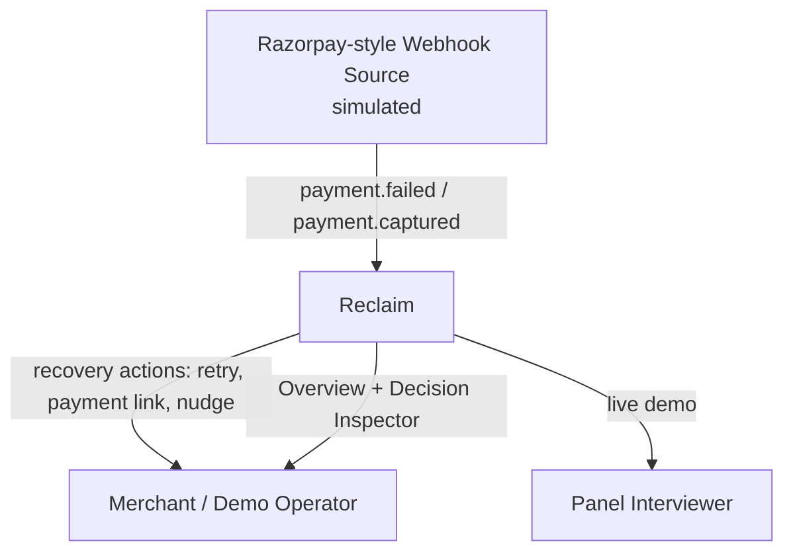
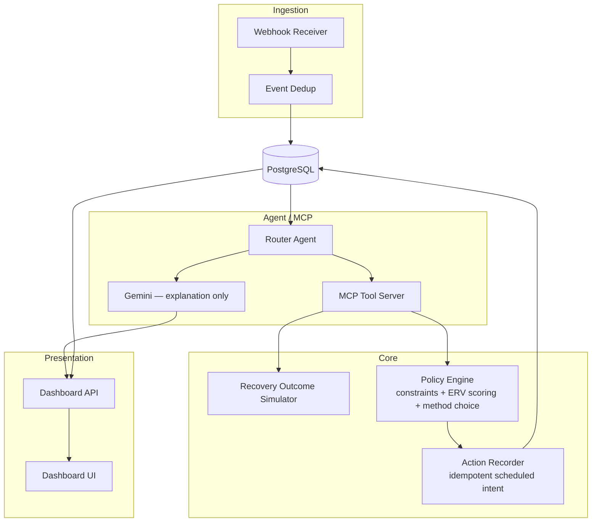
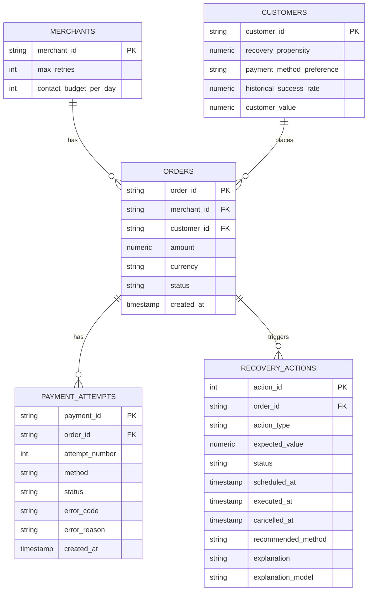
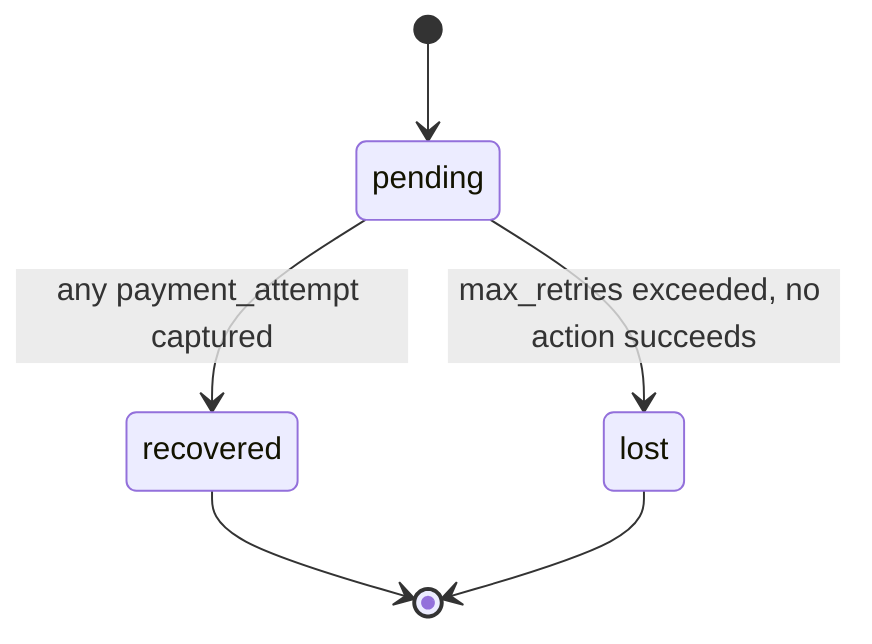
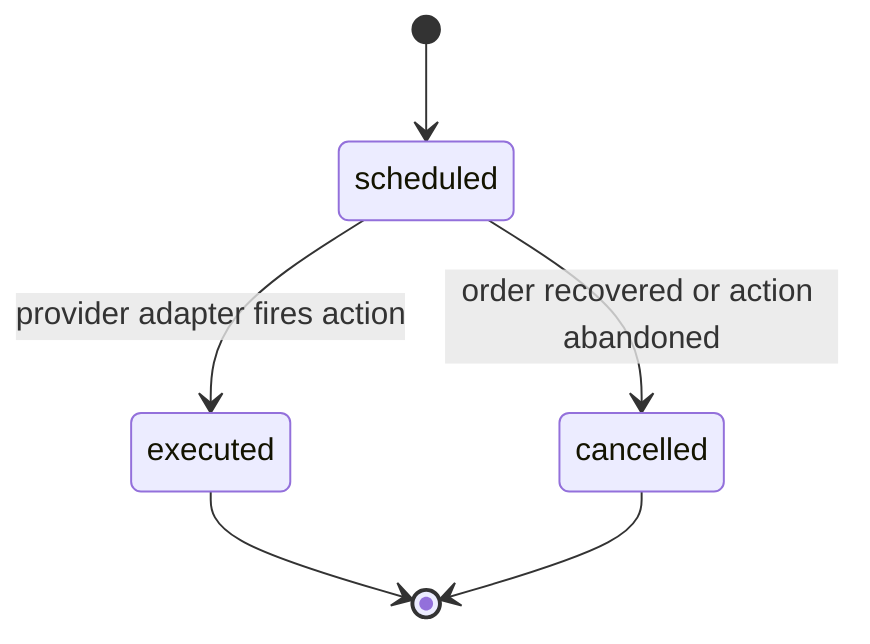
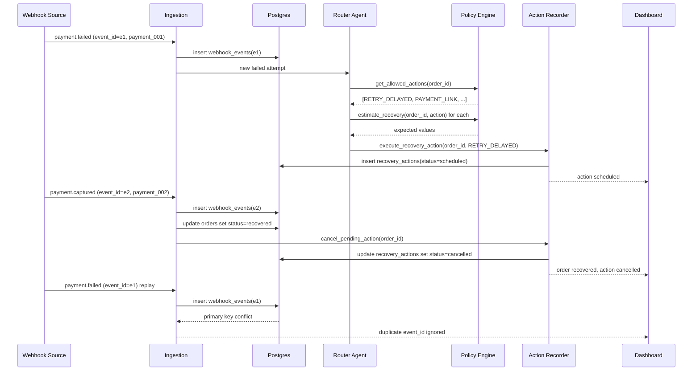
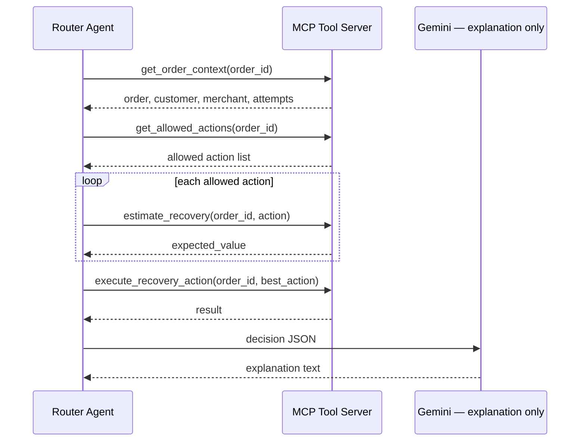
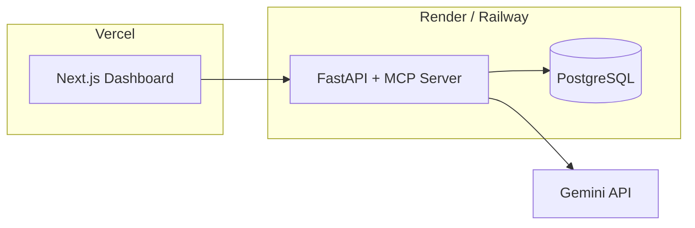

# Reclaim — System Design Document

Companion to `reclaim-build-plan.md`. That file has the schedule, pitch script, and panel prep. This file has the architecture: HLD, LLD, diagrams, tech stack, module design, API contract.

---

## 1. Overview

Reclaim ingests Razorpay-style `payment.failed` / `payment.captured` events, runs each failed attempt through a deterministic constraint gate and a statistical expected-value scorer, records the highest-value permitted recovery intent idempotently, and explains the decision via an LLM layer that never touches financial state itself.

---

## 2. Tech Stack

| Layer | Choice | Why |
|---|---|---|
| Backend / API | FastAPI (Python) | Simulator and policy-scoring logic is numeric; Python's ecosystem fits better than Node here, and keeping one language backend-to-agent reduces solo-build overhead. |
| Database | PostgreSQL | Row-level locking (`SELECT ... FOR UPDATE`) for order-level idempotency — same pattern as dispatchCore. |
| Agent / MCP | MCP Python SDK | Single-language backend; tools defined as plain FastAPI-adjacent functions, exposed via MCP. |
| LLM | Gemini API (Google) | Explanation layer only — receives a decision JSON, returns prose. Automatic function calling is disabled; never called to decide an action. |
| Frontend | Next.js + React + Tailwind | Matches CareerCompass / dispatchCore stack — no new framework to learn under deadline. |
| Charts | Recharts | Two charts total (Overview bar chart, Decision Inspector ERV comparison) — no need for a heavier library. |
| Testing | pytest | Idempotency and constraint-gate logic are exactly what a panel will probe — cover them with real tests, not manual clicking. |
| Deployment | Vercel (frontend) + Render or Railway (API + Postgres) | Free-tier, zero-ops, fast to stand up — this is a demo artifact, not production infra. |

---

## 3. High-Level Design

### 3.1 System Context

### 3.2 Container / Component Diagram

---

## 4. Low-Level Design

### 4.1 Data Model

Schema is identical to `reclaim-build-plan.md` §2. ER form:

`webhook_events(event_id PK, event_type, payload, processed_at)` is intentionally not linked with a foreign key — it's a pure dedup log, checked by primary-key insert before anything else runs.

### 4.2 State Machines

**Order:**

**Recovery action:**

### 4.3 Sequence Diagrams

**Core idempotency scenario** (the live-demo script from the build plan, §7):

**MCP tool-calling flow:**

### 4.4 Module Design

| Module | Responsibility | Key interface |
|---|---|---|
| `simulator/` | Generate synthetic orders + outcome probabilities from `simulator_config.yaml` | `generate_world(n, seed)`, `simulate_outcome(..., alternate_method)` |
| `policy/constraints.py` | Hard-constraint gate — evaluated before scoring, never mixed into it | `get_allowed_actions(order, attempt, merchant) -> list[ActionType]` |
| `policy/scoring.py` | Expected-value ranking on whatever survives the gate | `expected_value(context, action) -> float` |
| `policy/alternate.py` | Select a concrete route for `alternate_method` | `recommend_alternate_method(context) -> upi | another_card` |
| `agent/tools.py` | The five MCP tool functions (§4.3 sequence) | see build plan §6 |
| `agent/router.py` | Orchestration loop: context → allowed actions → score each → execute best | — |
| `agent/explain.py` | Gemini API call wrapper — decision JSON in, prose out, validated fallback | `explain_decision(decision) -> ExplanationResult` |
| `agent/tools.py` | Idempotent action recording, order-level row lock, auto-cancel on recovery | `execute_recovery_action(order_id, action) -> ActionResult` |
| `api/routes.py` | FastAPI routes, §4.5 | — |
| `db/models.py` | SQLAlchemy models mirroring §4.1 | — |

### 4.5 API Contract

| Method | Path | Purpose |
|---|---|---|
| `GET` | `/orders` | List orders with status, feeds Overview + Decision Inspector search |
| `GET` | `/orders/{order_id}` | Full context: attempts, candidate actions + ERVs, selected action/method, recovery actions, explanation |
| `POST` | `/webhooks/simulate` | Fire a simulated webhook event — this is what drives the live demo |
| `GET` | `/eval/summary` | `always_retry` vs `reclaim` comparison metrics |
| `GET` | `/health` | Liveness check |

---

## 5. Non-Functional Design Notes

**Idempotency:** `event_id` primary key rejects replayed webhooks at the insert. Order-level state transitions (attempt captured → order recovered → cancel pending actions) happen inside one transaction, row-locked on `orders.order_id`, so a captured-payment webhook and an in-flight recovery-action execution can't race.

**Consistency:** Single Postgres instance, transactional writes, no distributed state. The current executor records scheduled recovery intent; real provider execution and delayed-job delivery are explicit production follow-ups.

**Access control:** All public tables have RLS enabled with deny-all policies. The FastAPI backend connects directly via `DATABASE_URL` (psycopg2, server-side) and bypasses RLS as the database owner — so the app is unaffected. This blocks anyone reaching the DB through Supabase's REST endpoint or anon key, ensuring all writes go through the backend's idempotent / audited paths.

**What changes at scale (talking points only, not build items):** a queue (SQS/Kafka-equivalent) in front of a real provider executor to decouple webhook ingestion from action execution; the MCP tool calls would move from synchronous to async; read replicas for the dashboard so analytics queries don't contend with the write path; the simulator's config-driven probabilities would be replaced by a model trained on real merchant outcome data, with the same disclosure discipline applied to whatever replaces it.

---

## 6. Deployment View

Single API service hosting both the REST routes and the MCP tool server — no separate deployment needed for the agent layer at this scale.
